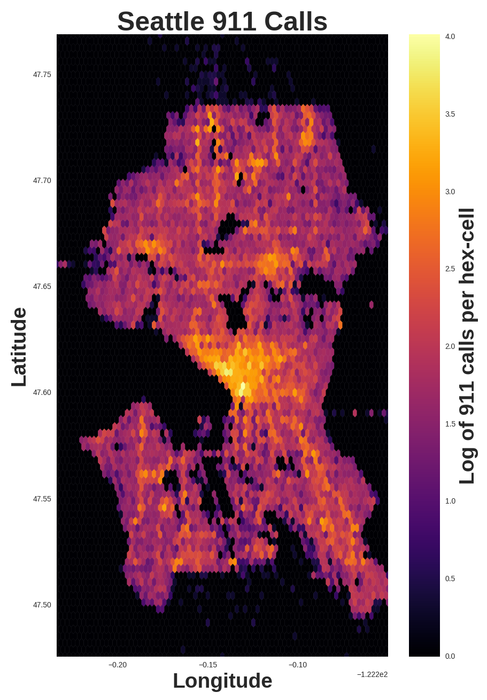
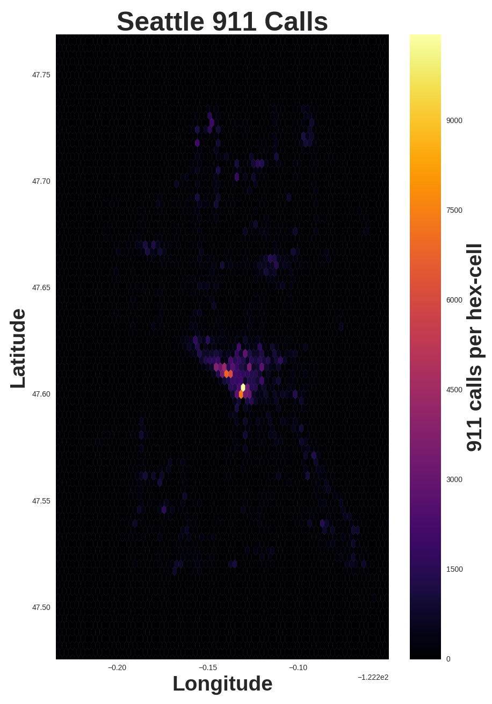
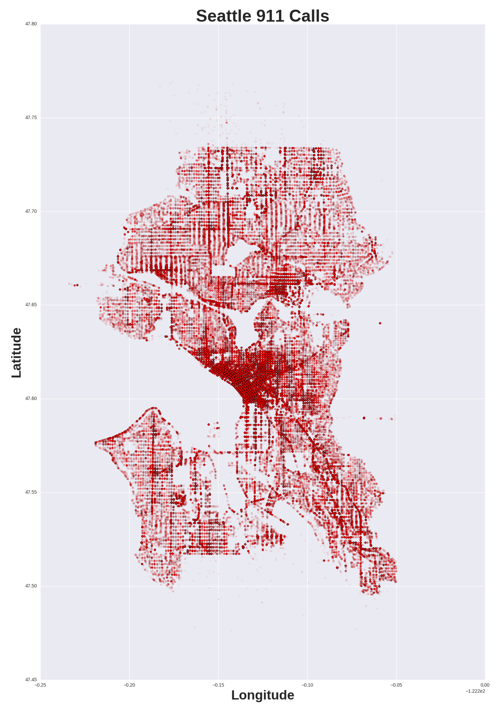

# Fitting Distributions to WHO Mortality by Age Data

#### Figure 1: All distributions in SciPy stats fitted to WHO mortality by age data for the United States.
 

#### Figure 2: Best fitting distribution with paramaters.

###### All probability distributions from SciPy Stats were fit to World Health Organization global mortality data for the United States.  Images are in the images folder and Python code can be found in the Jupyter Notebook in the src folder.

Death is a fascinating topic because it’s the one thing all human beings will share, but we never talk about it. I recently came across World Health Organization data on age and cause of death for over 600,000,000 people over the last several years.

I thought it would be interesting to study the distribution of age of death. In statistics, distributions are used to describe how frequently a particular value appears. Even if you have never studied statistics, you are already familiar with the idea of a bell curve. This shape occurs so commonly that it’s referred to as a normal distribution.
There are many distributions of varying shapes used in statistics. Several of these distributions are used to describe failure rates of machines over time as parts wear out. I suspected that these distributions might also be applicable to the human body because we are machines that wear out. As it turns out, these distributions do a terrible job of describing human mortality rates. One plausible explanation for this difference is that unlike machines, the human body has an amazing ability to heal itself. As we lose this ability we die at higher and higher rates.

Out of the nearly 100 distributions I fit to the data (Figure 1), it was the log gamma distribution that best matched (Figures 2). This is a pretty exotic distribution, but it appears that lifetime modeling and the medical field are two of its primary uses.
 

 
# Gephi Visualizations of Presidential Candidate Facebook Like Networks

#### Figure 1: Gephi visualization of the like network for Hillary Clinton's Facebook page.
 

#### Figure 2: Gephi visualization of the like network for Donald Trump's Facebook page.

###### Gephi network visualizations of Facebook pages liked by people who liked Hillary Clinton's and Donald Trump's Facebook pages.

I present to you my first attempts at network visualization. I used an app name NetVizz to scrape information from the Facebook pages of Donald Trump and Hillary Clinton about what other pages are liked by people who like the pages of Trump and Clinton. The graphs were created with a piece of software named Gephi.

These figures reveal very curious trends I won’t attempt to explain, but please feel free to share your interpretations. Figure 1 (Clinton’s graph) is curiously dominated by Wellesley College pages with a large portion being dedicated to Democratic party pages. The lobes seem to be largely unconnected. Figure 2 (Trump’s plot) on the other hand, is a bizarre salad of TV entertainment and luxury brands. Strangely, Glamour, Vera Wang, Stewart Weddings, and BRIDES are in the network of this loud misogynist as well.

 

 

# Seattle 911 Plots

#### Figure 1: Logarithmic heat map of Seattle 911 calls.
 

#### Figure 2: Heat map of Seattle 911 calls.
 

#### Figure 3: Plot of 550,000 Seattle 911 calls by location.
 
Plots of public [Seattle 911](https://data.seattle.gov/Public-Safety/Seattle-Police-Department-911-Incident-Response/3k2p-39jp/data) data in the images folder.  Python code can be found in the Jupyter Notebook in the src folder.

I’ve revisited the Seattle 911 data to create these heatmaps (or hexbin 3D histograms if you prefer). The colors represent the number of 911 calls placed from within that hex.

Notice that Figure 2 is nearly entirely blue with a single crimson cell near the center. The number of 911 calls placed from that cell is so much higher than any other cell, that it threw off the entire color scale. To reveal more definition, I created Figure 1 using a logarithmic scale. For those unfamiliar with logarithms, I applied some math to partially flatten the scale and capture more detail (https://en.wikipedia.org/wiki/Logarithmic_scale).

The mysterious crimson cell captured my curiosity so I examined it more closely. It is located where Downtown runs into Pioneer Square near the King County Courthouse. I had the biased assumption that high numbers of 911 calls would be associated with high crime rates, but the data revealed something entirely different. About three fourths of the calls were medically related, presumably due to the high concentration of people with limited resources, mental health issues, and addiction. Most of the remaining quarter were things like responses to automated fire alarms, bark fires, and a surprising number of elevator rescues. As it turns out, only a tiny portion of the calls were related to crime. The world is apparently safer and sadder than I imagined.

Figure 3 is a plot of the latitude and longitude for 550,000 calls placed to 911 in the city of Seattle. The shape of Seattle is quite clear because unsurprisingly, not a lot of 911 calls come from the bodies of water. The bridges however appear to hot spots presumably due to car accidents. Some places stand out for being devoid of calls such as the Zoo and the Port. Others, like downtown and good old Aurora are noticeably active. The striations that are visible in some of the residential areas are presumably the result of the algorithms are used anonymize the location by adding uncertainty. I plan to revisit this data with heat mapping.

 

